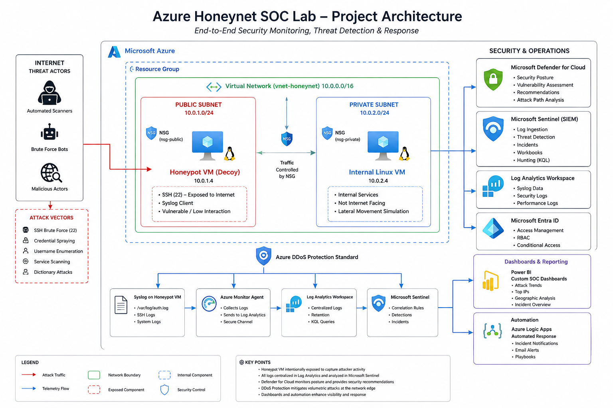

# Azure Honeynet SOC Monitoring Lab

## Overview

This project demonstrates the design, deployment, monitoring, and investigation of a cloud-based honeynet environment hosted in Microsoft Azure. The environment was intentionally exposed to the public internet to attract malicious activity and generate realistic security telemetry for analysis.

The lab simulates the responsibilities of a Security Operations Center (SOC) Analyst by collecting attack data, performing threat hunting, validating indicators of compromise (IOCs), conducting packet analysis, and producing professional incident reporting.

---

## Objectives

* Deploy a publicly accessible Linux honeypot in Azure
* Generate real-world attack telemetry
* Centralize logging within Microsoft Sentinel
* Monitor security posture using Microsoft Defender for Cloud
* Enrich attack data using GeoIP intelligence
* Investigate attacker behavior using KQL
* Analyze network traffic using Wireshark
* Produce executive and technical security reports
* Build SOC-style dashboards and visualizations

---

## Architecture

.


---

## Technologies Used

| Technology                    | Purpose                        |
| ----------------------------- | ------------------------------ |
| Microsoft Azure               | Cloud Infrastructure           |
| Ubuntu Linux                  | Honeypot Operating System      |
| Microsoft Sentinel            | SIEM Platform                  |
| Log Analytics Workspace       | Log Collection                 |
| Microsoft Defender for Cloud  | Security Posture Management    |
| Azure Network Security Groups | Network Segmentation           |
| Azure DDoS Protection         | Network Protection             |
| Kusto Query Language (KQL)    | Threat Hunting                 |
| Wireshark                     | Packet Analysis                |
| VirusTotal                    | Threat Intelligence Validation |
| Zui                           | Packet Analysis                |
| GeoIP Enrichment              | Attack Attribution             |

---

## Environment Components

### Public Honeypot VM

Purpose:

* Internet-facing attack target
* SSH exposed to the internet
* Generates adversary telemetry
* Captures authentication attempts

### Internal VM

Purpose:

* Simulated internal asset
* Demonstrates network segmentation
* Used for lateral movement simulation scenarios

### Microsoft Sentinel

Purpose:

* Centralized monitoring
* Threat hunting
* Incident analysis
* Security reporting

### Microsoft Defender for Cloud

Purpose:

* Secure Score monitoring
* Hardening recommendations
* Exposure analysis
* Security posture management

---

## Threat Hunting Activities

The following activities were conducted throughout the project:

### SSH Brute Force Detection

Monitoring:

* Failed SSH authentication attempts
* Username targeting patterns
* High-volume source IPs

### GeoIP Analysis

Enriched attacker IP addresses with:

* Country
* Latitude
* Longitude

Used to build:

* Attack maps
* Geographic threat visualizations

### Threat Intelligence Validation

Suspicious IPs were validated using:

* VirusTotal

Findings confirmed:

* Known SSH brute-force infrastructure
* Automated scanning activity
* Credential spraying campaigns

### Packet Analysis

Network captures were collected using:

```bash
sudo tcpdump -i any -w honeypot-capture.pcap
```

Analysis performed with:

* Wireshark

Findings included:

* SSH scanning activity
* Connection probing
* Authentication attempts

No malware payloads or successful compromise activity were observed.

---

## Key Findings

### Total Attack Activity

Over 7,000 SSH-related attack events were observed during the monitoring period.

### Most Targeted Usernames

* root
* admin
* ubuntu
* debian
* pi
* ftp
* ubnt
* AdminGPON
* orangepi

### Most Active Source IPs

| Source IP      | Attempts |
| -------------- | -------- |
| 190.123.65.197 | 456      |
| 36.189.207.209 | 412      |
| 183.6.91.151   | 388      |
| 120.48.0.142   | 299      |
| 45.148.10.121  | 168      |

### Attack Characteristics

Observed activity was consistent with:

* SSH brute-force attacks
* Credential spraying
* Internet-wide scanning
* Automated attack tooling

No successful compromise was identified.

---

## MITRE ATT&CK Mapping

| Technique                | ID    |
| ------------------------ | ----- |
| Brute Force              | T1110 |
| Valid Accounts           | T1078 |
| Network Service Scanning | T1046 |
| External Remote Services | T1133 |

---

## Sample KQL Queries

### SSH Attack Detection

```kusto
Syslog
| where ProcessName == "sshd"
| project TimeGenerated, Computer, SyslogMessage
| sort by TimeGenerated desc
```

### Top Attacking IP Addresses

```kusto
Syslog
| where ProcessName == "sshd"
| extend SourceIP = extract(@"(\d+\.\d+\.\d+\.\d+)",1,SyslogMessage)
| summarize Attempts=count() by SourceIP
| top 20 by Attempts desc
```

### GeoIP Enrichment

```kusto
Syslog
| where ProcessName == "sshd"
| extend SourceIP = extract(@"(\d+\.\d+\.\d+\.\d+)",1,SyslogMessage)
| extend GeoInfo = geo_info_from_ip_address(SourceIP)
| extend Country=tostring(GeoInfo.country)
| summarize AttackCount=count() by Country
```

---

## Security Improvements Implemented

* Azure DDoS Protection enabled
* Network Security Group segmentation
* Log Analytics centralized collection
* Microsoft Sentinel monitoring
* Microsoft Defender for Cloud recommendations applied
* Continuous threat hunting
* GeoIP attack attribution
* Incident reporting workflow established

---

## Skills Demonstrated

### Cloud Security

* Azure Infrastructure
* Virtual Networking
* Security Groups
* DDoS Protection

### SOC Operations

* Threat Hunting
* Log Analysis
* Incident Investigation
* IOC Validation

### Detection Engineering

* KQL Query Development
* Alert Development
* Attack Pattern Analysis

### Network Security

* Packet Capture
* Traffic Analysis
* Protocol Investigation

### Reporting

* Executive Reporting
* Technical Reporting
* MITRE ATT&CK Mapping
* Risk Assessment

---

## Future Enhancements

* Microsoft Defender for Endpoint Integration
* Custom Analytics Rules
* Automated Incident Creation
* SOAR Playbook Integration
* Threat Intelligence Feeds
* Malware Detonation Environment
* Automated GeoIP Dashboards
* Real-time Power BI Integration

---

## Author

**Thatoyaka Malope**

Security Operations • Cloud Security • Threat Hunting • Microsoft Sentinel • Azure Security

---

## Disclaimer

This environment was created solely for educational, research, and defensive cybersecurity purposes. All attack telemetry was collected from unsolicited internet activity directed at intentionally exposed lab resources. No offensive actions were performed against third-party systems.
